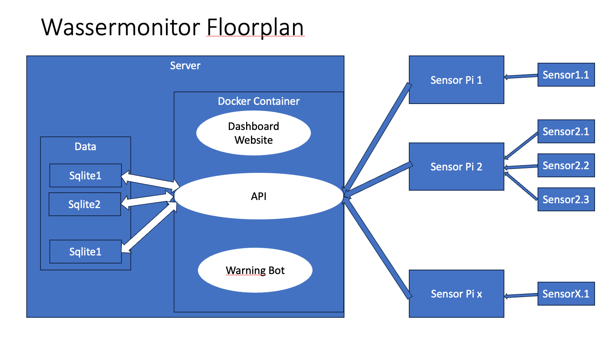
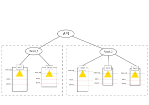
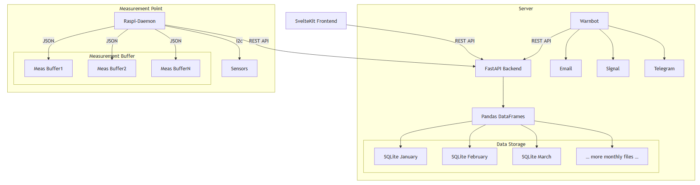

Basics
======

What is Wassermonitor made for?
-------------------------------

Project Floorplan
-----------------

    This is the floorplan of the project.

    More concrete example of the structure.
    A single server supports several distributed measurement points.

Techstack
---------

    Techstack of Wassermonitor2

Bla bla bla

.. toctree::
   :maxdepth: 3
   :caption: Contents: