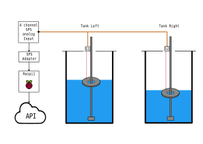
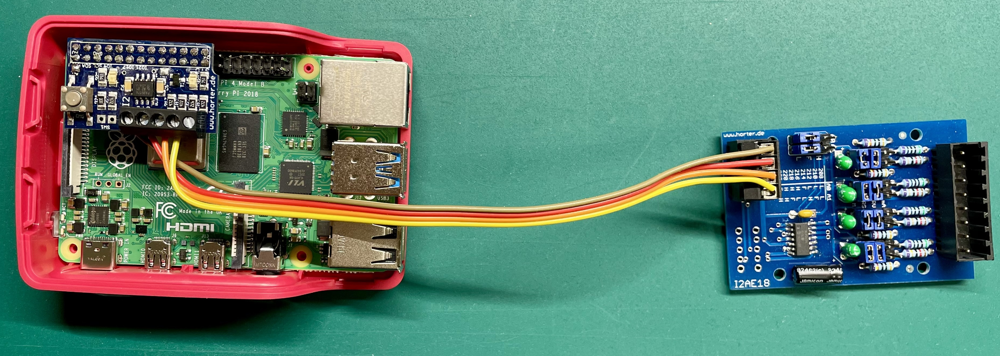
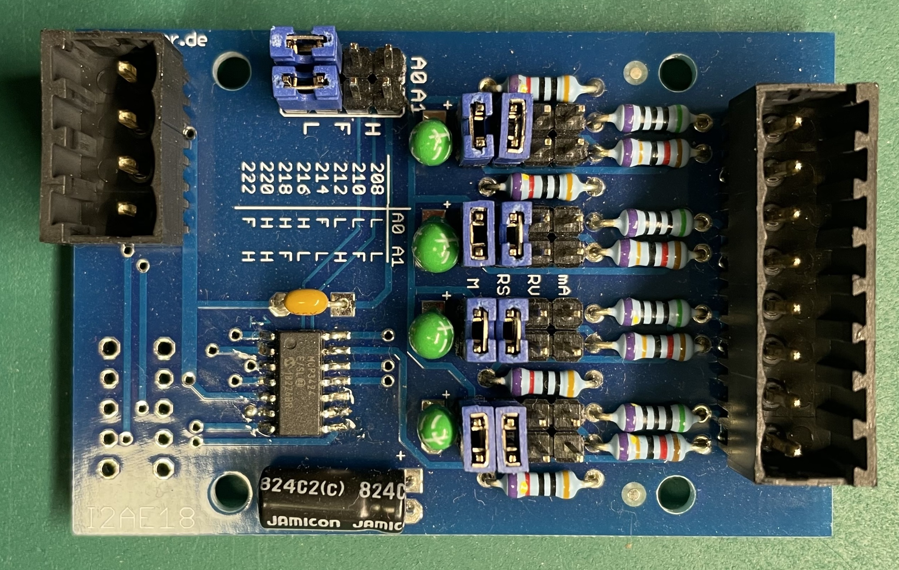
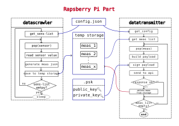

Measurement Points
==================

General
-------------
A wassermonitor measurement point consists of a raspberry pi (raspi), a stack of adapter cards to
talk with sps-standard-sensors and the sensors with their setup themselves.

The raspi is responsible for the following features:
    * General
        * Read structure and sensor information from a configuration file
        * Talk with sensors and save measurement values in a local sqlite-file
        * Convert raw-value to calibrated value
        * Sign the stored measurement data with private key and send them to the server api
    * Additional
        * Provide script for calibration file generation

Example
-------
In this example we see the following setup.

    Typical measurement point setup with a single raspberry pi connected with two sensors via an sps-adapter-card-stack.
    With the current setup, four sensors can be connected to a single raspi.

.. image:: pictures/Meas_Setup_details.svg

Raspberry Pi Setup
------------------

Basic Setup
~~~~~~~~~~~

At first, please follow `this tutorial <https://projects.raspberrypi.org/en/projects/raspberry-pi-setting-up/4>`_ to setup the sd card for your raspberry pi.

After that please activate the i2c-bus on your device to enable communicating with the sensors:

.. code-block:: console

    sudo raspi-config
    navigate to Interfacing-Options >> I2C
    Would you like to ARM I2C interface to enabled? --> <Yes>

Buffer Volume
~~~~~~~~~~~~~

.. code-block:: console

    sudo mkdir /mnt/buffervol
    sudo chmod 770 /mnt/buffervol

    sudo mount /dev/sda1 /mnt/buffervol/
    sudo cp /etc/fstab /etc/fstab.backup

    lsblk -lf -o+PARTUUID /dev/sda
        NAME FSTYPE FSVER LABEL UUID                                 FSAVAIL FSUSE% MOUNTPOINTS PARTUUID
        sda
        sda1 vfat   FAT32       .red {<your-uuid>}                              57.3G     0% /mnt/buffervol

    sudo nano /etc/fstab

add a line to fstab to mount your buffer device automatically on mount:

.. code-block:: console

    UUID=<your-uuid>  /mnt/buffervol  vfat    auto,nofail,sync,users,rw,umask=000     0       0

Install wassermonitor pi software
~~~~~~~~~~~~~~~~~~~~~~~~~~~~~~~~~

1. Download source from code-server

    .. code-block:: console

        wget https://code.wassermonitor.de/WM2_Pi_|version|.tar.gz
        wget https://code.wassermonitor.de/WM2_Pi_|version|.tar.gz.sha256

2. Verify checksum

    .. code-block:: console

        sha256sum -c WM2_Pi_|version|.tar.gz
        sha256sum -c WM2_Pi_|version|.tar.gz.sha256

    Output should seem like:

    .. code-block:: console

        WM2_Pi_|version|.tar.gz: OK

3. Extract source

    .. code-block:: console

        tar xzvf WM2_Pi_|version|.tar.gz

4. Create virtual environment and install requirements

    .. code-block:: console

        python3 -m venv .venv
        source .venv/bin/activate
        pip3 install -r requirements.txt

5. Create calibration file

For this step, you need a special setup to place a dummy target in a specified distance from your sensor.
Wassermonitor will not work without this step!

    .. code-block:: console

        cd Pi/
        python3 calib.py

6. Create private key

    1. Create Key Pair

        .. code-block:: console

            python3 generate_key_pair.py

    2. ON THE SERVER: Edit /etc/wassermonitor/authorized_keys and add public key which comes from generate_key_pair.py standard output.

7. Configure Pi-System

    1. edit config.json with your settings. Configure your sensors, and API settings

    .. code-block:: JSON

        {
          "name": "teststation",
          "api_url": "https://api.url",
          "token": "secret_token",
          "psk_path": ".psk",
          "temp_storage_path": "/mnt/buffervol",
          "count_of_vals_per_meas": 5,
          "meas_interval": 30,
          "sensors": [
            {
              "name": "sens1",
              "type": "IFM_O1",
              "tank_height": 155,
              "max_val": 135,
              "warn": 90,
              "alarm": 70,
              "calib_file": "calib/calib_date_sensor_1.csv",
              "i2c": {
                "addr": "0x68",
                "name": "0",
                "id": "13",
                "StBy": 128
              }
            },
            {
              "name": "sens2",
              "type": "IFM_O1",
              "tank_height": 155,
              "max_val": 135,
              "warn": 90,
              "alarm": 70,
              "calib_file": "calib/calib_date_sensor_2.csv",
              "i2c": {
                "addr": "0x68",
                "name": "0",
                "id": "13",
                "StBy": 160
              }
            }
          ]
        }

    2. Configure datacrawler as a system daemon
        TBD

    3. Configure datatransmitter, that sends data e.g. every minute. Therefore edit contab with

        .. code-block:: console

            crontab -e

    Add

    .. code-block:: console

        */1 * * * * /path/to/datatransmitter.py

    to the file and save it. Allow the system to install a new crontab

5.

Hardware
--------

What hardware do we need to build a wassermonitor measurement point?

Partlist
~~~~~~~~

* Raspberry Pi 4 (tested): https://www.raspberrypi.com/products/raspberry-pi-4-model-b/
* SPS Interface
    * I2C-repeater:
        * https://www.horter-shop.de/de/i2c-hutschienen-module/181-305-bausatz-i2c-repeater-mit-taste-fur-raspberry-pi-4260404261179.html#/25-klemmen-feste_klemmen
        * Manual: https://www.horter.de/blog/i2c-repeater-pegelanpassung-fuer-raspberry-pi/
    * 4-channel-ADC:
        * https://www.horter-shop.de/de/i2c-hutschienen-module/249-453-bausatz-i2c-analog-input-4-kanal-18-bit-mit-mcp3424-4260404260899.html#/25-klemmen-feste_klemmen
        * Manual: https://www.horter.de/blog/i2c-analog-input-4-kanaele-18-bit-mit-mcp3424/

* Sensors
    * Optical
        * IFM O1: https://www.ifm.com/de/de/product/O1D110
        * Wiring
        * Swimmer: see "Swimming Device"
    * Ultrasonic
        * TBD

Part-assembly
~~~~~~~~~~~~~

.. figure:: pictures/I2C_Adapter_w_Input_Card.jpeg
    :width: 80%

    The I2C Adapter for modifing the voltage levels and analog input card with four channels.

    Raspi with connected sps adapter chain. This setup is ready to directly connect analog sps sensors.

    Details pic of the analog input card with four analog channels. The jumpers in this pictures are placed to use the analog 0-10V sps interface of the sensors.

Software
--------

This chapter gives a deeper insight into the part of Wassermonitor that runs on the raspberry pis of the distributed measuring points.
The structure of this software is divided into two main parts, as can be seen in this figure:

    This is the floorplan of the pi module.

As one can see, the software on the raspis consists of two main parts, the datascrawler on the one hand and the transmitter part on the other hand.
Both of the software parts are configured by the same configuration JSON in the config.json-file

.. code-block:: JSON

    {

    "name": "raspi1",                               // name of the measurement point
    "api_url": "http://127.0.0.1:8012",             // api of the url
    "token": "secret_token",                        // secret token for api authentification (optional)
    "psk_path": ".psk",                             // directory where priv and pub-key for data signing are located (generate_key_pair.py)
    "temp_storage_path": "/tmp/wassermonitor",      // directory where measurement data is stored until transmitting
    "count_of_vals_per_meas": 5,                    // Sensor values per measurement (with 1s sleep time)
    "meas_interval": 60,                            // Sleep time during measurements
    "sensors": [                                    // List of sensors connected (max. 4)
        {
            "name": "left_tank",                    // sensor name
            "type": "IFM_O1",                       // sensor type
            "tank_height": 155,                     // zero offset of the sensor
            "max_val": 135,                         // maximum value
            "warn": 90,                             // warning threshold
            "alarm": 70,                            // alarm threshold
            "calib_file": "calib/calib_date_sensor_3.csv",  // location of calibration file
            "i2c": {                                // i2c communication details
                "addr": "0x68",
                "name": "0",
                "id": "13",
                "StBy": 128
            }
        },
    ]
    }

Datascrawler
~~~~~~~~~~~~
The datascrawler part of the raspi-software should be installed as a systemd-daemon.

Datatransmitter
~~~~~~~~~~~~~~~
At the moment, the transmitter is designed to be run by a cron job, but it should be rebuilt to ran as a systemd-daemon as well.

.. toctree::
   :maxdepth: 3
   :caption: Contents:

